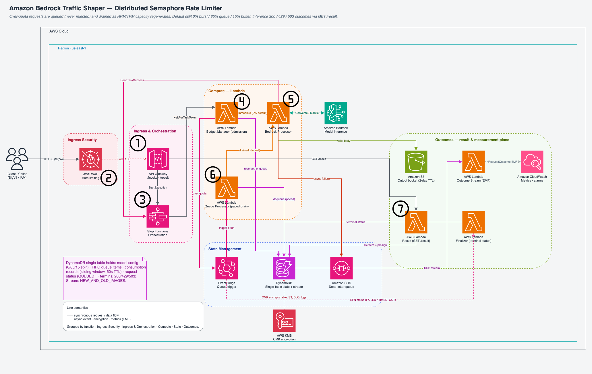

# Bedrock Traffic Shaper

A distributed, semaphore-style rate limiter for **Amazon Bedrock**, built entirely on AWS-native
services (API Gateway, Step Functions, Lambda, DynamoDB, EventBridge, S3, SQS, KMS). When a burst of requests exceeds a model's quota, the shaper **queues the overflow and drains it at the model's RPM/TPM pace** instead of rejecting it — trading latency for reliability so asynchronous GenAI workloads stop losing requests to throttling. Every request resolves to exactly one honest, client-readable terminal outcome.

**Background:** This project accompanies a two-part AWS Builder Center series. [Part 1 — *Managing Traffic Spikes with Amazon Bedrock: Why Traditional Retry Patterns Fail*](https://builder.aws.com/content/34CVjaGLlDJXGBUv15vR3dLnoy2/managing-traffic-spikes-with-amazon-bedrock-why-traditional-retry-patterns-fail-part-1) frames the problem this repository solves. [Part 2 — *Building a Resilient Inference Engine is Essential for GenAI Workloads*](https://builder.aws.com/content/3DgcVkGOGQWumJouGwVKKdP9yyW/building-a-resilient-inference-engine-is-essential-for-genai-workloads) is the narrative walkthrough with traffic-pattern scenarios and load-test results (local copy: [`docs/blog.md`](docs/blog.md)).

## The problem

GenAI traffic is spiky: requests arrive in bursts, not at a steady rate. The usual answer is client-side retry logic — exponential backoff with jitter — which degrades under real load. Retries pile onto an already-throttled endpoint, amplify call volume, burn the quota legitimate requests need, and still drop a meaningful fraction of them. The failure is structural, not a tuning problem: every client reacts to the same `429` at the same moment.

## The solution

The shaper puts a single **admission gate** in front of Bedrock where each request is admitted against a per-model capacity budget computed from a **sliding-window read** of recent consumption. Requests that fit the budget go straight to Bedrock; requests that don't are enqueued and drained by a background processor paced to the model's requests-per-minute and tokens-per-minute quota. A Step Functions callback (`waitForTaskToken`) holds each request open so both the immediate and queued paths resume the *same* execution with a full Bedrock response.

The result is deterministic backpressure instead of retry storms: overflow waits in a FIFO queue
rather than hammering a throttled endpoint. This suits **asynchronous workloads where reliability matters more than per-request latency**.

## Architecture



> **Editable source:** [`architecture/traffic-shaper-architecture-v2.drawio`](architecture/traffic-shaper-architecture-v2.drawio)
> (open in [diagrams.net](https://app.diagrams.net)); an [SVG render](architecture/traffic-shaper-architecture-v2.svg) is also checked in.
> Older `.svg` files under [`architecture/`](architecture/) predate this design (they still show the removed CloudFront edge).

A request flows through the system in the order below; the numbers map to the component table that follows.

1. **API Gateway** (regional REST) receives `POST /invoke` with IAM/SigV4 auth and integrates *directly* with Step Functions `StartExecution` — no ingress Lambda proxy.
2. **WAFv2** (regional web ACL on the `prod` stage) rate-limits per tenant / per IP at the door.
3. **Step Functions** opens a `waitForTaskToken` callback and owns the request for its whole lifecycle.
4. **Budget Manager** admits against a sliding-window budget — under budget goes straight to Bedrock, over budget is enqueued.
5. **Bedrock Processor** calls Bedrock, reconciles token estimates, writes the body to **S3**, records the terminal status in **DynamoDB**, and sends the SFN callback.
6. **Queue Processor** drains the FIFO queue at the model's RPM/TPM pace for the enqueued overflow.
7. **`GET /result/{request_id}`** (Result Lambda) returns the one honest terminal outcome (200 / 429 / 503 / 504).

| # | Component | Role |
|---|-----------|------|
| 1 | **API Gateway (REST, regional)** | `POST /invoke` ingress (`AWS_IAM` / SigV4), integrated directly with Step Functions `StartExecution` — no Lambda proxy at the front door. `GET /result/{request_id}` is a separate Lambda-proxy poll endpoint. |
| 2 | **WAFv2 web ACL (REGIONAL)** | Associated to the API Gateway `prod` stage. Per-tenant rate limit keyed on the `X-Tenant-ID` request header, plus a per-IP fallback limit. |
| 3 | **Step Functions** | One Standard state machine per request (`ReserveBudget` → `Success`), using the `waitForTaskToken` callback pattern. 65-minute timeout; X-Ray tracing enabled. |
| 4 | **Budget Manager Lambda** | Admission gate — reads recent consumption over a sliding window and either admits (invokes Bedrock Processor) or enqueues the overflow. |
| 5 | **Bedrock Processor Lambda** | Backend-aware Bedrock caller for both immediate and queued paths. Reconciles token estimates to actuals, persists the completion to S3, writes the terminal status, then sends the SFN callback. |
| 6 | **Queue Processor Lambda** | Event-driven, single-owner (lock-guarded) background drain, paced to the model's RPM/TPM. |
| 7 | **Result Lambda** | Serves `GET /result/{request_id}` — reads the terminal-status item and presigns the S3 output. |
| 8 | **DynamoDB single table** | Unified state: model config, burst/queue consumption records, queue items, processor locks, and per-request terminal status. Streams enabled (`NEW_AND_OLD_IMAGES`). |
| 9 | **S3 output bucket** | Holds inference completion bodies (customer-managed KMS, 2-day lifecycle expiry). The status item stores only an `output_ref`. |
| 10 | **SQS DLQ** | Captures failed asynchronous Bedrock invocations for inspection. |
| 11 | **Outcome Stream Lambda** | DynamoDB Streams handler; the single authoritative emitter of the `RequestOutcome` metric. |
| 12 | **Finalizer Lambda** | EventBridge target on SFN status changes (`FAILED`/`TIMED_OUT`/`ABORTED`) — records an honest terminal outcome when no per-request writer committed one. |
| 13 | **KMS CMK** | Customer-managed key encrypting the table, output bucket, DLQ, log groups, and Lambda environment. |

Full walkthrough — schema, callback flow, sliding-window admission, and 429-vs-503 classification —
in [`docs/solution/architecture.md`](docs/solution/architecture.md).

## Outcome semantics

Every request resolves to exactly one terminal outcome, readable via `GET /result/{request_id}`:

| Code | Meaning |
|------|---------|
| **202** | Accepted — still pending or queued (retry with `Retry-After`). |
| **200** | Success — presigned S3 output URL returned. |
| **429** | Account TPM / rate quota exceeded (Bedrock throttle, or ingress throttle). |
| **503** | Model serving capacity exceeded, or other backend error. |
| **504** | Request timed out or the queued item expired before it could be served. |
| **400** | Validation error (bad `model_id`, oversized input). |

## Deployment

### Prerequisites

- An AWS account you can deploy into (the stack creates API Gateway, WAF, Step Functions, Lambda,
  DynamoDB, EventBridge, S3, SQS, and KMS resources).
- AWS CLI installed and configured — verify with `aws sts get-caller-identity`. If you use AWS SSO
  and your session expired: `aws sso login --profile your-profile`.
- Bedrock model access enabled in your account and region for at least one model (Nova, Jamba, or
  Claude). The shaper calls Bedrock on your behalf.

| Tool | Version | Notes |
|------|---------|-------|
| Python | 3.10+ | CDK app and `scripts/` tooling; a virtualenv is created by `make setup`. |
| Node.js | 18+ | Required by the AWS CDK CLI. |
| AWS CDK CLI | 2.1033.0+ | `deploy.sh` enforces this minimum (`npm install -g aws-cdk@2.1033.0`). |
| `jq` | any | Parses CDK outputs into `config.env`. |

### First-time setup

Bootstrap once per account + region, then run the one-shot setup. `make setup` creates the
virtualenv, installs dependencies, deploys the `SemaphoreRateLimiterStack`, and writes `config.env`
from the stack outputs (every later `make` command reads it). The stack defaults to `us-east-1`.

```bash
cdk bootstrap        # once per account + region
make setup           # venv + deps + deploy SemaphoreRateLimiterStack + write config.env
make deploy          # redeploy after a code change — regenerates config.env, preserves CONFIG records
```

### Configure a model, send traffic, inspect

The shaper reads a per-model `CONFIG` record from DynamoDB for that model's quota and burst/queue
split. A low `BURST_CAPACITY` forces requests to queue so you can watch the shaper work; drop it to
use model defaults. `MODEL` takes a short alias (`nova-2-lite`, `sonnet-5`, `opus-5`, `haiku-4-5`, …)
or a full Bedrock model ID.

```bash
# 1. create a model config (low burst → watch requests queue; omit BURST_CAPACITY for defaults)
make create-config MODEL=nova-2-lite RPM=10 BURST_CAPACITY=2

# 2. send 5 test requests (with the config above: ~2 immediate, ~3 queued)
make test

# 3. query table state first (what happened), then logs (why)
make inspect-config       MODEL=nova-2-lite
make inspect-queue-single MODEL=nova-2-lite
make inspect-consumption  MODEL=nova-2-lite
make logs-queue-recent

# 4. reset between runs — clears queue/consumption/locks, preserves CONFIG
make clean
```

> `make test` calls Bedrock for real — ensure the model behind your alias is enabled in your
> account/region, or requests fail at the Bedrock call and land in the DLQ.

Additional knobs (`RPM`, `TPM`, `COUNTER_SHARDS`, `BURST_FRACTION`, `QUEUE_FRACTION`, …) are
documented in the guide. All operations go through the [`Makefile`](Makefile) — run `make help` for
the full list. See [`docs/guide/configuration.md`](docs/guide/configuration.md) for every
model-config field and [`docs/guide/invoke-api.md`](docs/guide/invoke-api.md) for the `POST /invoke`
request/response contract.

## When to use it

- Asynchronous or batch GenAI pipelines (summarization, enrichment, evaluation, offline generation)
  where a request can wait seconds-to-minutes for a response.
- Workloads that spike well above their steady-state Bedrock quota and currently lose requests to
  throttling.
- Cases needing deterministic, observable backpressure and a dead-letter path for permanently failed
  requests rather than best-effort client retries.

## When not to use it

- Interactive, latency-critical paths (chat UIs, low-latency inference) — queued requests can take
  materially longer than a direct call.
- Traffic that comfortably fits within quota, where a simple retry policy is sufficient.
- Workloads needing large responses today (see the output-token limitation below).

## Limitations and known constraints

- **Shaper, not a hard semaphore.** Admission is a strongly-consistent *read* over a sliding window
  of recent consumption, not an atomic counter, so concurrent reservations can each read the window
  before the others' writes land. **Bounded over-admission is accepted by design**; any drift ages
  out within the `LONG_WINDOW_SECONDS` horizon (default **15 s**), which is the self-healing
  correctness horizon. When over-admission does reach Bedrock and throttles, the throttle surfaces
  as an honest terminal `429` rather than being silently retried.
- **256 KB Step Functions payload limit.** Request payloads ride in the execution state, which is
  capped at 256 KB, bounding per-request input size. Completion bodies are written to S3 and
  referenced by `output_ref`, so large *responses* do not hit this limit; large *inputs* still do.
- **Output-token cap.** The processor enforces a per-request output-token cap from the model config;
  raise it there for longer responses.
- **429-vs-503 distinction is backend-dependent.** On the default `runtime`/Converse backend, account
  throttles map to `429` and serving-capacity / other failures map to `503`. On the `mantle` backend,
  both upstream `429` and `503` are currently folded into a terminal `429` — a serving-capacity `503`
  is not distinguished from an account-quota `429` on that path.
- **Per-tenant WAF rate limit trusts a client-supplied header.** The per-tenant rate rule keys on the
  `X-Tenant-ID` request header, which the caller sets. It is not cryptographically bound to the SigV4
  principal, so a caller can evade per-tenant limiting by omitting or spoofing the header (the per-IP
  fallback rule still applies). This is a documented limitation of the reference implementation.
- **Content safety is the caller's responsibility.** The shaper is a transport / rate-limiting
  layer; it does not inspect, filter, or moderate prompt or response content. Apply Amazon Bedrock
  Guardrails and your own responsible-AI controls in the calling application.
- **Reference implementation, not production.** This stack is demo/load-test grade. Several security
  postures are intentionally relaxed for an internal prototype (documented in the cdk-nag
  suppressions) and should be hardened before any production promotion — see
  [`docs/solution/production-hardening.md`](docs/solution/production-hardening.md).

## Repository layout

| Path | Contents |
|------|----------|
| `infrastructure/` | CDK stack (`semaphore_stack.py`), Lambda handlers, and the shared Lambda layer. |
| `scripts/` | Test and utility scripts, all invoked via `make` (load tests, soak tests, config, inspection). |
| `docs/` | Documentation, split by audience — see [`docs/README.md`](docs/README.md). |
| `docs/guide/` | Task references complementing the Quick start: configuration reference, invoke-API contract, regional/partition notes. |
| `docs/solution/` | How the shaper works: architecture, runbook, cost model, ADRs, design notes. |
| `docs/testing/` | Testing: unit, simulation, and load tests — methodology and authoritative results. |
| `architecture/` | Architecture diagram — `.drawio` source plus PNG/SVG renders (`traffic-shaper-architecture-v2.*`). |
| `reports/` | Generated charts and soak-test result files. |
| `Makefile` | Developer workflow entry point (`make help`). |
| `config.env.template` | Configuration template; `config.env` is generated by `deploy.sh` and gitignored. |

## Documentation

Start at the **[documentation index](docs/README.md)**. Highlights:

- [Configuration reference](docs/guide/configuration.md) — every model-config field and alias.
- [Architecture](docs/solution/architecture.md) — how it works, end to end.
- [Operator runbook](docs/solution/runbook.md) — alarm response, latency SLAs, DLQ consumer.
- [Cost model](docs/solution/cost-model.md) — infrastructure cost analysis.
- [Testing campaign](docs/testing/README.md) — load-test methodology and results.

## Testing

Load and soak tests are driven through `make` (`make test-budget-manager`, `make test-direct-bedrock`,
`make soak-test`, `make test-multi-model`). The authoritative methodology, results, and the honesty
gate for interpreting success rates live in [`docs/testing/`](docs/testing/README.md) — read that
index before quoting any number.

### Results: shaper vs. unshaped baseline under real overload

Each model was driven **3–6× past its real Bedrock TPM quota** as a concurrent large-input burst
(unique prompts, so prompt-cache reads don't hide the load), then the *identical* offered load was
replayed through the shaper at a queue-only cap (0% burst / 85% queue / 15% buffer). A throttled
(429) request is rejected before inference, so **it contributes zero tokens to effective TPM**.

| Model (TPM quota) | Throttling: baseline → **shaper** | Latency p50: baseline → shaper | Result |
|---|---|---|---|
| ~1M (small) | 13–16% → **27–43%** | ~1s → ~2–3 min | ✗ **worse** — batch-of-10 release too bursty for a tiny quota |
| 2M | 42% → **8%** | ~4s → ~2.5 min | ✓ mostly removed |
| 4M | 28–68% → **0–2%** | ~1s → ~2.5 min | ✓ eliminated |
| 5–6M | 54–60% → **3–7%** | ~1s → ~2.5 min | ✓ eliminated / mostly removed |
| 20M (×3 models) | 43–66% → **0–7%** | ~1s → ~2.4 min | ✓ eliminated |
| 30M (largest) | 38% → **0%** | ~6s → ~2.5 min | ✓ eliminated |

**The story in one line:** on every quota-enforcing model from ~2M upward, the shaper takes heavy
throttling (**up to ~68% of requests failing**) down to **0–8%**, converting would-be 429s into
*completed* requests (e.g. at 30M quota, 1,390 → 2,019 completions from the same overload). It only
backfires at ~1M, where its fixed batch release is itself too bursty for the small per-second budget.
The trade everywhere is **latency**: shaped requests wait in the queue (~2–3 min under sustained
overload) instead of failing instantly. The benefit grows with model size.

> **⚠️ Read these caveats before quoting the numbers.**
> - **Latency is the cost.** The shaper trades instant 429s for queue wait. Under sustained 3–6×
>   overload, end-to-end p50 is minutes; for latency-sensitive traffic this matters.
> - **Not a free win below ~2M quota.** The fixed batch-of-10 queue release spikes over small
>   per-second budgets and can throttle *worse* than no shaper. Tune batch size for small quotas.
> - **Prompt caching skews measurement.** Cached input tokens don't count toward TPM, and the
>   Converse `inputTokens` field excludes them (use `totalTokens`). Load tests must use unique
>   prompts, or the offered load is silently absorbed by the cache. (Nova auto-caches; Claude
>   caches only with an explicit checkpoint.)
> - **"Effective TPM" here is served-token volume, not a rate.** Baseline bursts ran sub-minute;
>   the shaper drains over minutes — so higher shaper throughput means *more completed requests*,
>   not a higher instantaneous rate (it paces at/under its cap ≈ 0.8× quota).
> - **This is a rate/throughput shaper, not a capacity multiplier.** It cannot exceed the real
>   quota; it only stops you burning requests on 429s up to it.

Per-model raw numbers (by model ID) are in `reports/` and [`docs/testing/`](docs/testing/README.md).

## Disclaimer

This is sample code — not thoroughly tested, secured, or optimized for production use.

Portions of this solution — code, tests, and documentation — were developed with the assistance of
generative AI (AI-assisted coding). All content has been human-reviewed, but you should independently
review, test, and validate it before any use.

## Contributing and license

Contribution guidelines: [`CONTRIBUTING.md`](CONTRIBUTING.md). Security policy and vulnerability
reporting: [`SECURITY.md`](SECURITY.md). Licensed under **MIT-0 (MIT No Attribution)** — see
[`LICENSE`](LICENSE).
