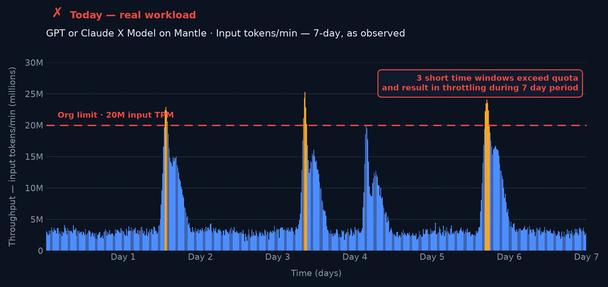
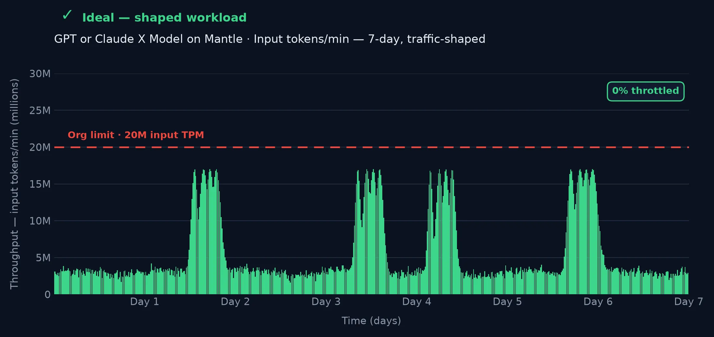
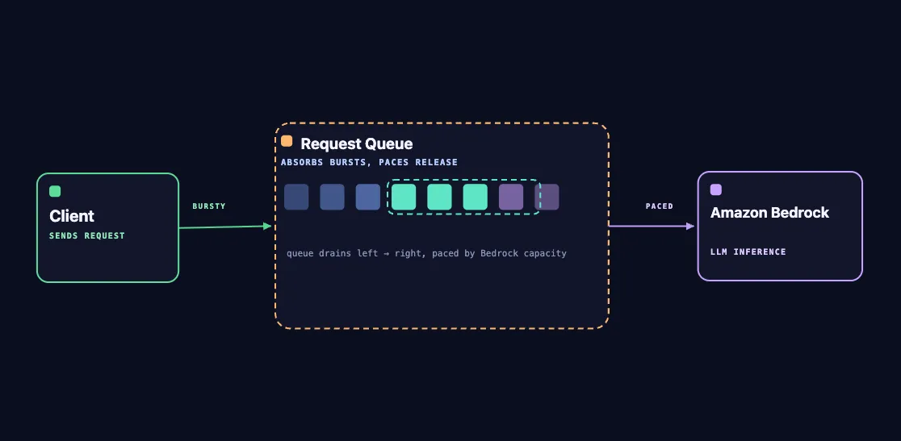
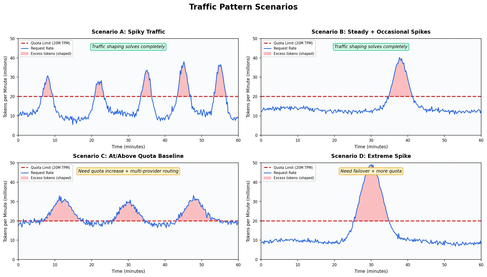
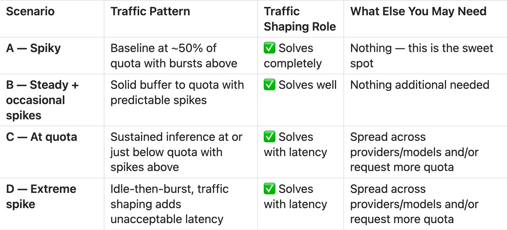
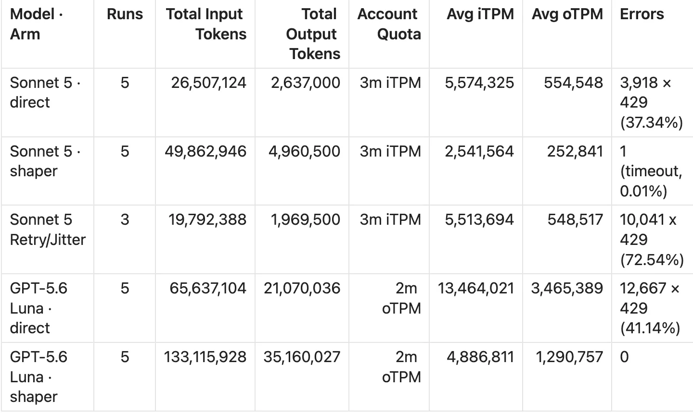
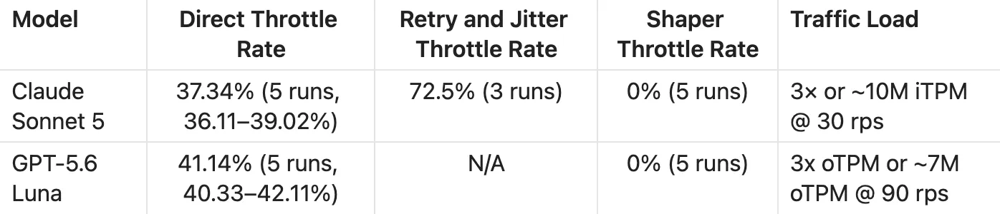
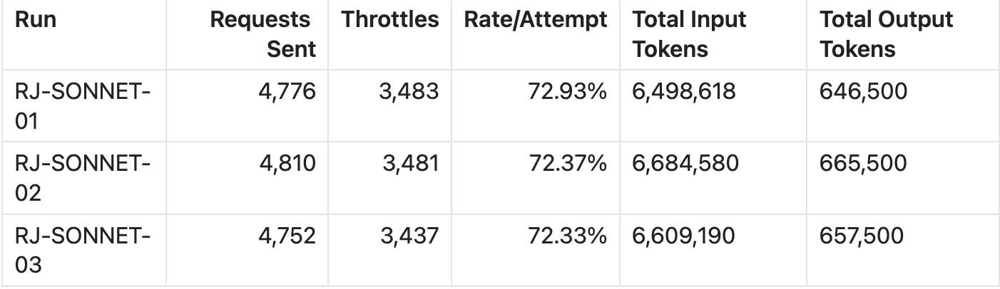
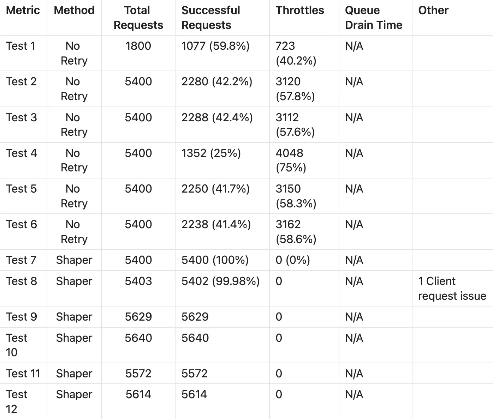

# Building a Resilient Inference Engine is Essential for GenAI Workloads

**Managing Traffic Spikes with Amazon Bedrock — Part 2**

> Adapted from the published AWS Builder Center article "Building a Resilient Inference Engine is Essential for GenAI Workloads" by Ryan Sachs, Nick McCord, and Alex Moening (AWS). Figures are reproduced from the published article.

## Introduction

In Part 1, we explained why traditional retry patterns fail for Amazon Bedrock workloads and introduced proactive rate limiting as the alternative. At that time, we hypothesized that exponential backoff with jitter creates feedback loops which amplify failures. In this post, we put the theory to the test.

Since Part 1, Amazon Bedrock's quota model has evolved. More and more models are standardizing on enforcing tokens per minute (TPM) instead of both TPM and requests per minute (RPM) limits:

- Nova 2 Lite on `bedrock-runtime`: 8M TPM (combined input + output). 2000 RPM.
- Claude Opus 4.8 on `bedrock-runtime`: 30M TPM (combined input + output). No RPM.
- Claude Sonnet 5 on `bedrock-mantle`: 3M input TPM / 300k oTPM. No RPM.
- GPT-5.6 on `bedrock-mantle`: 10–20M input TPM / 1–2M output TPM. No RPM.

This article focuses on TPM-based throttling and how to design your inference backend for high availability with more consistent and predictable throughput. The core tradeoff is introducing latency into your workload.

## How workloads fail today

Across industry verticals and spend profiles, customer inference workloads tend to be consistently inconsistent. One minute you get 3× what your quota can handle, and then you might spend the next 20 minutes utilizing a small percentage of your throughput. Traffic shaping smooths out your traffic so your workloads consistently utilize the available throughput. We've seen first-hand from many customer workloads similar to this profile where traffic shaping can have a meaningful impact on inference resiliency:

*Customer workload traffic on Bedrock typically looks like this. Baseline runs near 3–5M TPM, but three short windows spike above the 20M input-TPM limit and result in throttling.*

Putting traffic shaping in front of the inference workload would change the throughput to something like the image below without requiring any quota increases.

*Traffic shaping can smooth out peaks in traffic to keep you below throughput limits.*

These few traffic spikes result in poor user experiences and frustration that can lead to loss of business. The pain of downtime and/or increased error rates for limited timeframes also leads to undesirable administrative overhead that can be reduced — and in some instances eliminated — through traffic shaping.

## How it works

The traffic shaper reserves 85% of your quota capacity for constant throughput, leaving 15% of your capacity as a margin of safety. Requests are drained from the queue with a sliding window and regeneration-aware pacing, which together normalize constant throughput with minimal throttling. We found in load testing that increasing beyond 85% can begin to introduce minor throttling, while decreasing below 85% leaves throughput on the table. This configuration can be altered per model and per workload.

The traffic shaper intentionally overrides default boto3 settings to remove retries. Only one request is sent to Bedrock per incoming request. This is intentional, to ensure the highest probability of a successful request. Customers implementing this have event-driven experiences, or make UX tweaks to make it clear that the request is in a queue.

What does this look like in practice? If you have a quota of 1 million tokens per minute, this solution will attempt to utilize 850k TPM constantly. When your application receives a traffic spike of 3 million tokens in 15 seconds, the queue absorbs the spike and drains in ~3.5 minutes — which in many cases is preferable to the application experiencing downtime or a high percentage of failed requests.

## Architecture

*The traffic shaper buffers and strategically drains the queue. The client sends bursty requests; the queue absorbs the bursts and paces the release, draining left → right at a rate matched to Bedrock capacity.*

The implementation uses AWS serverless services:

- **DynamoDB** for request tracking, queue management, and model configuration (single-table design)
- **Step Functions** for request lifecycle orchestration using the callback pattern (`waitForTaskToken`)
- **Budget Manager Lambda** to add requests to the queue
- **Queue Processor Lambda** to drain queued requests as capacity regenerates
- **Bedrock Processor Lambda** to call the Bedrock API for queued requests

We are working to open-source this solution so you can give it a try.

## Know your traffic pattern

Understanding your traffic pattern determines the right strategy. In some workloads the latency will not be tolerable, and sometimes the answer is to increase the quota or to utilize multiple inference backends. In many scenarios, traffic shaping gives you resiliency and the ability to know when your request is unlikely to be fulfilled.

*The shape of your inference workload likely falls into one of these buckets — the four common traffic-spike scenarios.*

| Scenario | Traffic pattern | Traffic shaping role | What else you may need |
|---|---|---|---|
| A — Spiky | Baseline at ~50% of quota with bursts above | Solves completely | Nothing — this is the sweet spot |
| B — Steady + occasional spikes | Solid buffer to quota with predictable spikes | Solves well | Nothing additional needed |
| C — At quota | Sustained inference at or just below quota with spikes above | Solves with latency | Spread across providers/models and/or request more quota |
| D — Extreme spike | Idle-then-burst; shaping adds unacceptable latency | Solves with latency | Spread across providers/models and/or request more quota |

## Should you use retry/jitter?

We fired 1,000 requests at Amazon Nova 2 Lite in a single burst within 30 seconds. Each request carried ~18,500 tokens, producing 18.5M tokens against a 4M TPM quota — a 4.6× overload.

| Metric | No Retry | Retry + Jitter | Traffic Shaper |
|---|---|---|---|
| Success rate | 74.4% | 14.3% | 100% |
| Failed requests | 256 (lost) | 857 (lost) | 0 |
| Total API calls | 1,000 (1×) | ~3,900 (3.9×) | 1,000 (1×) |
| p99 latency | ~0.3s (fast fail) | ~29s | ~260s (queue drain) |

Our retry implementation follows the industry-standard pattern recommended by AWS SDKs and distributed-systems best practices:

- **Max retries:** 3 attempts after the initial request (4 total)
- **Backoff formula:** `min(30s, 1s × 2^attempt)` — producing delays of 1s, 2s, and 4s
- **Jitter:** full jitter — `random.uniform(0, computed_delay)` per attempt
- **Retry condition:** only on HTTP 429 (`ThrottlingException`)

In our 1,000-request test, 256 initial throttles triggered retries, which consumed quota needed by other in-flight requests, causing more throttles and triggering more retries. After 3 retry rounds, 1,000 original requests had generated ~3,900 total API calls. Of those, roughly 2,568 accomplished nothing except stealing capacity from legitimate first-attempt requests. This is why "no retry" (74.4%) outperformed "retry + jitter" (14.3%).

For production inference workloads, implementing retries is actually counter-productive, and we do not recommend it for spiky workloads.

## Traffic shaping at scale

The Nova 2 Lite test proved the concept on a single model, demonstrating the negative impact of retries and jitter. To validate production readiness, we ran extensive testing across Bedrock Mantle and Bedrock Runtime endpoints. We re-ran the validation campaign against Claude Sonnet 5 and GPT-5.6 Luna at roughly 3× their configured quotas, comparing direct-to-Bedrock behavior against the shaper. We tested breaching Sonnet's iTPM and GPT Luna's oTPM quotas, demonstrating that the solution can fulfill either rate-limiting quota.

*Summarized view of Sonnet 5 and GPT-5.6 Luna load tests.*

| Model · Arm | Runs | Total input tokens | Total output tokens | Account quota | Avg iTPM | Avg oTPM | Errors |
|---|---|---|---|---|---|---|---|
| Sonnet 5 · direct | 5 | 26,507,124 | 2,637,000 | 3M iTPM | 5,574,325 | 554,548 | 3,918 × 429 (37.34%) |
| Sonnet 5 · shaper | 5 | 49,862,946 | 4,960,500 | 3M iTPM | 2,541,564 | 252,841 | 1 (timeout, 0.01%) |
| Sonnet 5 · retry/jitter | 3 | 19,792,388 | 1,969,500 | 3M iTPM | 5,513,694 | 548,517 | 10,041 × 429 (72.54%) |
| GPT-5.6 Luna · direct | 5 | 65,637,104 | 21,070,036 | 2M oTPM | 13,464,021 | 3,465,389 | 12,667 × 429 (41.14%) |
| GPT-5.6 Luna · shaper | 5 | 133,115,928 | 35,160,027 | 2M oTPM | 4,886,811 | 1,290,757 | 0 |

*`429` is the HTTP throttling response code.*

### Key findings

- The shaper delivers more token throughput and zero throttles at identical offered load. Mean delivered tokens were higher through the shaper than direct-to-Bedrock, on the dimension where each model's quota actually binds (input tokens for Sonnet 5, output tokens for Luna).
  - **Claude Sonnet 5 (input tokens):** 9,972,589 (shaper) vs 6,626,781 (direct) — **+50.5%**
  - **GPT-5.6 Luna (output tokens):** 7,032,005 (shaper) vs 4,214,007 (direct) — **+66.9%**
- Total per-minute token throughput achieved depends on model latency; queue drain time is predictable.
  - **Claude Sonnet 5:** 2,541,564 measured vs a 2.55M/min iTPM allocation. Completion averaged 235.4s to drain (spread 12.6s across 5 runs).
  - **GPT-5.6 Luna:** 1.2M oTPM measured vs 1.7M oTPM allocation. Completion averaged 326.9s (spread 6.6s across 5 runs).
- The core tradeoff of throttling vs. latency is the key decision. Mean completion was 235s (Sonnet 5) and 327s (Luna) — a 4–5.5× longer window in exchange for eliminating a 37–41% loss rate.
- Adding retry and jitter does not improve overall throughput. The same average throughput is achieved without it, while retries double the likelihood of an individual request failing.

### Throttle-rate summary

| Model | Direct throttle rate | Retry + jitter throttle rate | Shaper throttle rate | Traffic load |
|---|---|---|---|---|
| Claude Sonnet 5 | 37.34% (5 runs, 36.11–39.02%) | 72.5% (3 runs) | 0% (5 runs) | 3× or ~10M iTPM @ 30 rps |
| GPT-5.6 Luna | 41.14% (5 runs, 40.33–42.11%) | N/A | 0% (5 runs) | 3× oTPM or ~7M oTPM @ 90 rps |

## Testing methodology

Achieving the required request throughput used a load-testing setup that drove many concurrent clients against the endpoints. All requests sent to the models did not use prompt caching and were of similar size. For production workloads, both of these factors will impact model latency, and you may want to tweak the way you drain items from the queue accordingly.

Supporting evidence for the Nova and Sonnet-5 runs is in [`docs/testing/results.md`](testing/results.md) (see its Appendix); the GPT-5.6 Luna figures are cited from the published article and were not reproduced in this repository.

## Scaling bottlenecks

At scale, the ceilings are AWS service limits with well-understood solutions — categorically different from a Bedrock throttle, which drops your request with no recourse. A few of the scaling challenges we ran into:

| Service | Limit hit | Default quota | Mitigation |
|---|---|---|---|
| Step Functions | `StartExecution` API throttle | 1,500/s refill, 5,000 bucket | Request quota increase |
| Lambda | Concurrent executions | 1,000 (default) | Request increase; reserved concurrency |
| DynamoDB | Single-partition read throughput | 3,000 RCU | Partition sharding |
| DynamoDB | Single-partition write throughput | 1,000 WCU | Partition sharding |
| Bedrock | Model latencies | N/A | Update queue-draining algorithm |

When load-testing Opus, we found that 400 RPS caused DynamoDB to throttle through read capacity units. For every two or three hundred RPS, we recommend configuring another shard for production workloads. We increased our Step Functions `StartExecution` limit and Lambda concurrency to 5,000 each and did not run into any further throttling from those services.

GPT-5.6 Luna, in particular, experienced longer per-request latencies during load testing, which limited the TPM achieved under the current implementation. For production workloads you may need to customize the speed at which you drain your queue to fully utilize your allocated quota on Bedrock.

## Conclusion

Inference workloads are inherently spiky and must operate within throughput constraints. Increasing quota limits can provide short-term relief, but quota increases alone do not add resiliency, predictability, or high availability to your product. Traffic shaping, by contrast, addresses outages more permanently by buffering consistent traffic to Bedrock within your limits. This approach is especially valuable if you occasionally spike above your quota, or if you can tolerate the latency tradeoff of request queuing.

Exponential backoff doesn't rescue a throttled workload — it deepens the hole. Load tests with Nova 2 Lite and Sonnet 5 both demonstrate that your success rate per request plummets. The reflex that's supposed to add resilience is the thing costing you the most. Traffic shaping flips the model: instead of firing into a wall and retrying the wreckage, you pace into the quota and let a queue absorb the spikes. In our tests that meant near-zero dropped requests and near-zero throttling, at the cost of latency you can measure, predict, and design around. For a spiky workload, that beats a quota increase and a retry loop every time.

What to do with your inference workload:

- **Profile your traffic.** Find your baseline and your spikes. If you look like Scenario A or B, shaping likely solves your throttling outright. If you're C or D, shaping still helps — pair it with more quota or a second backend.
- **Kill your retry-on-429 logic for spiky Bedrock inference.** It's not helping; the data says it's hurting.
- **Pace your drain to 70–85% of quota** and watch your error rates and token throughput.

## Appendix — baseline retry/jitter run detail

| Run | Requests sent | Throttles | Rate/attempt | Total input tokens | Total output tokens |
|---|---|---|---|---|---|
| RJ-SONNET-01 | 4,776 | 3,483 | 72.93% | 6,498,618 | 646,500 |
| RJ-SONNET-02 | 4,810 | 3,481 | 72.37% | 6,684,580 | 665,500 |
| RJ-SONNET-03 | 4,752 | 3,437 | 72.33% | 6,609,190 | 657,500 |

### No-retry vs. shaper across 12 tests

| Test | Method | Total requests | Successful requests | Throttles |
|---|---|---|---|---|
| Test 1 | No Retry | 1,800 | 1,077 (59.8%) | 723 (40.2%) |
| Test 2 | No Retry | 5,400 | 2,280 (42.2%) | 3,120 (57.8%) |
| Test 3 | No Retry | 5,400 | 2,288 (42.4%) | 3,112 (57.6%) |
| Test 4 | No Retry | 5,400 | 1,352 (25%) | 4,048 (75%) |
| Test 5 | No Retry | 5,400 | 2,250 (41.7%) | 3,150 (58.3%) |
| Test 6 | No Retry | 5,400 | 2,238 (41.4%) | 3,162 (58.6%) |
| Test 7 | Shaper | 5,400 | 5,400 (100%) | 0 |
| Test 8 | Shaper | 5,403 | 5,402 (99.98%) | 0 |
| Test 9 | Shaper | 5,629 | 5,629 | 0 |
| Test 10 | Shaper | 5,640 | 5,640 | 0 |
| Test 11 | Shaper | 5,572 | 5,572 | 0 |
| Test 12 | Shaper | 5,614 | 5,614 | 0 |
